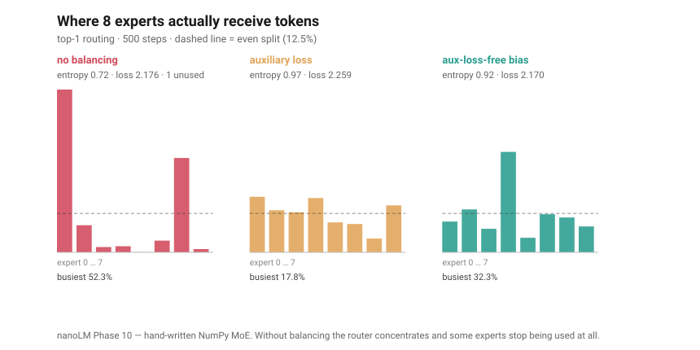

# I built a small language model in NumPy, by hand. Here are the numbers.

I wanted to understand transformers without a framework hiding the work. So I wrote one in NumPy and derived every gradient myself. No PyTorch for the first six phases, no autograd. The result is nanoLM: about 5,000 lines that start as a toy bigram and end at a sparse Mixture-of-Experts model, the architecture every serious open-weight release now uses.

The constraint I set was simple. Each phase adds one idea and ships something I can run. Nothing goes in until I can compute its gradient by hand.

```
+-------+--------------------------------------+--------------------------------------+
| Phase | What I built                         | Idea it teaches                      |
+-------+--------------------------------------+--------------------------------------+
| 0-1   | Config, logger, tokenizer, loader    | Tracking, tokenization               |
| 2     | NumPy bigram + backprop by hand      | Embeddings, loss, gradient descent   |
| 3-4   | Self-attention, multi-head, N layers | The transformer block; depth & width |
| 5     | AdamW, LR schedule, val split        | Real training recipes                |
| 6     | Greedy, temperature, top-k, top-p    | Sampling knobs                       |
| 7     | PyTorch mirror on Apple Silicon      | Why frameworks exist                 |
| 8     | Instruction fine-tune, DPO sketch    | Base model to assistant              |
| 9     | RoPE, RMSNorm, SwiGLU, GQA, KV-cache | The 2017 to 2023 gap                 |
| 10    | Mixture of Experts, load balancing   | Why 2026 models are sparse           |
+-------+--------------------------------------+--------------------------------------+
```

## Phase 2: a model you can actually watch learn

A bigram over a 24-character vocab has 3,096 parameters. The trainer prints exactly where they come from:

```
  Layer     Shape       Params
  embed.E   (24 x 64)    1,536
  proj.W    (64 x 24)    1,536
  proj.b    (24,)           24
  TOTAL                  3,096
```

At init the model is maximally confused: cross-entropy 3.18, perplexity 24.0. That perplexity means "all 24 characters look equally likely." After 300 steps of plain gradient descent it drops to 2.13, perplexity 8.4. So the model went from guessing among 24 options to roughly 8.

The run takes 232 ms. That is about 1,300 gradient steps per second on a laptop CPU, no GPU. When the loop is that fast you stop waiting and start trying things, which is most of the point of building small.

Scaling stops being vague too. Add a real transformer block and you jump from 3K params to 212,352 (1 layer, D=128). Go to 4 layers and 4 heads and it is 805,632. "7B vs 70B" means something once you can print the table and point at where the numbers come from.

## Phase 9: the modern stack, one flag at a time

This was the part I was waiting for. Take the GPT-2-era model and add what models after 2023 actually use, each behind its own switch so I can see the effect in isolation.

RoPE replaces the learned position table with a rotation of the query and key vectors. The dot product then depends on the distance between two tokens, not their absolute positions. No extra parameters. RMSNorm drops the mean and the bias from LayerNorm and works just as well with less compute. SwiGLU swaps ReLU for a gated activation; I size its hidden layer to about 8D/3 rounded to 64, same as LLaMA, so the parameter count stays fair.

GQA lets several query heads share one key/value head. On my 4-layer model, going from 8 KV heads to 2 cut total parameters by 11.4% and shrinks the inference cache. KV-cache stops recomputing attention over the full history every step. The win grows with context: I measured 2.8x at a 32-token window and 4.9x at 128. int8 quantization stores weights as 8-bit integers plus a scale, which compressed the weight matrices 7.9x with an average error around 2e-4.

Stacked together, the biggest config I run is 4.2M parameters and still trains on a CPU. Tiny, but it shares every structural idea with the large ones.

## Phase 10: making it sparse, and one expert eating half the traffic

Phase 9 got me to roughly a 2023 model. Everything released since is sparse: instead of one feed-forward network per block, you get many, and a router sends each token to only a couple of them. Total parameters go up, parameters used per token stay flat.

That gap is easy to see once you can print it. Same model, only the expert count changing:

```
+---------+-------------+---------------+-------+
| experts | total       | active/token  | ratio |
+---------+-------------+---------------+-------+
|       1 |     119,104 |       119,104 | 1.00x |
|       2 |     192,960 |       119,232 | 1.62x |
|       4 |     340,672 |       119,488 | 2.85x |
|       8 |     636,096 |       120,000 | 5.30x |
|      16 |   1,226,944 |       121,024 | 10.14x|
+---------+-------------+---------------+-------+
```

Sixteen experts is ten times the stored parameters for essentially the same work per token. The only thing that grows on the active side is the router itself, which is one small matrix.

Writing the backward pass taught me something the papers state but do not dwell on. Gradient flows through the gate weights of the chosen experts and through the experts themselves. It never flows through the *choice* — top-k is an argmax, and an argmax has no derivative. Nothing in the loss pushes the router to spread tokens out.

So it does not. I trained the same model three ways on 8 experts with top-1 routing:

```
+--------------------+------------+---------+----------------+--------+
| strategy           | final loss | entropy | busiest expert | unused |
+--------------------+------------+---------+----------------+--------+
| no balancing       |     2.1764 |   0.719 |         52.3%  |  1 / 8 |
| auxiliary loss     |     2.2587 |   0.972 |         17.8%  |  0 / 8 |
| aux-loss-free bias |     2.1699 |   0.919 |         32.3%  |  0 / 8 |
+--------------------+------------+---------+----------------+--------+
```



An even split would be 12.5% each. Left alone, one expert took **52.3%**, a second took 30%, and one received 0.1% of tokens — it was never going to learn anything. Early winners get more gradient, get better, and win more.

The two fixes are interestingly different. The classic auxiliary loss adds a term that rewards even load. It works — nothing unused, entropy 0.97 — but it is a second objective competing with predicting the next token, and the loss got *worse*: 2.176 to 2.259. The newer approach (DeepSeek-V3's) adds no loss term at all. Each expert carries a bias that is added to its score when picking the top-k and excluded from the weight it gets. After every step, overloaded experts have their bias nudged down and underloaded ones up. No gradient, no competing objective. It kept every expert alive and landed at the best loss of the three.

That is a small model reproducing the argument the paper makes at trillion-parameter scale, which was the moment this stopped feeling like a toy.

## The useful part: three features that quietly did nothing

This is the thing I did not expect to learn, and it is not about transformers.

Three times now I have shipped something, watched the loss go down, called it done, and been wrong. None of them crashed. That is the whole problem.

The first was response masking. Instruction fine-tuning is supposed to compute loss only on the assistant's reply, not the prompt. My code built a per-token mask and then collapsed it into one number and scaled every gradient by it. That is the same as training on the full sequence at a lower learning rate. The prompt tokens were still being learned. The feature did not exist.

The second was quantization. My function rounded the weights to the int8 grid and then stored them back as float64. The error was real but the memory savings, the entire point, were zero. I checked the file size before and after. Identical.

The third I found while writing Phase 10, and it is my favourite because of how it surfaced. I was trying to make the router collapse and could not. Then I noticed the unbalanced run produced byte-identical numbers whether I scaled the router's initial weights by 1, by 25, or by 100. Initialization cannot be irrelevant. Something was wrong.

It was the gate. I computed it as a softmax over just the selected experts' scores. With top-2 that is fine. With top-1 you are taking a softmax over a single number, which is always exactly 1.0 — a constant. Constants have no derivative, so the router received precisely zero gradient and never moved off its random initialization. The routing was frozen from step one. Scaling the initial weights changed nothing because an argmax does not care about scale.

Real top-1 routing takes the gate from the softmax over *all* experts without renormalizing, which is what Switch Transformer does and why. One line. Once fixed, the router learned, and it promptly collapsed onto one expert — which is what I had been trying to observe in the first place.

All three passed their tests. The tests asked "does loss go down" and "is the error small," not "is this doing what it says." That is the trap with hand-written ML. A wrong sign or a dead gradient does not crash. It just makes training a bit worse and you go blame the data.

The fix that changed how I work on this: a gradient-check test. For every backward pass I wrote, it compares my analytic gradient to a finite-difference of my own forward pass. They agree to about 1e-12 across attention, GQA, RoPE, SwiGLU and the norms. Masking now zeros the prompt gradient, and I assert it: perturb a masked token and the loss moves by exactly 0. Quantization now actually shrinks the model. The router has a test asserting its gradient is non-zero at every top-k, which would have caught the third bug on the day I wrote it. The suite is at 166 tests.

## The numbers, in one place

```
+---------------------------------+--------------------+
| Measurement                     | Result             |
+---------------------------------+--------------------+
| bigram params                   | 3,096              |
| bigram loss (300 steps)         | 3.18 -> 2.13       |
| bigram perplexity               | 24.0 -> 8.4        |
| training speed (CPU)            | ~1,300 steps/sec   |
| params: 1L -> 4L (D=128)        | 212,352 -> 805,632 |
| GQA kv=8 -> kv=2                | -11.4% params      |
| KV-cache speedup (32 / 128 ctx) | 2.8x / 4.9x        |
| int8 weight compression         | 7.9x  (err ~2e-4)  |
| largest config                  | 4.2M params        |
| MoE 16 experts: total / active  | 10.14x             |
| MoE busiest expert, unbalanced  | 52.3% (of 12.5%)   |
| MoE routing entropy, none/bias  | 0.72 -> 0.92       |
| gradient-check agreement        | ~1e-12             |
| tests                           | 166                |
+---------------------------------+--------------------+
```

## If you try this

Build the smallest version that still contains the real mechanism. A 24-character vocab teaches the same cross-entropy gradient as a 100K BPE vocab and fits in your head. Print one weight and watch it move. And when something "works," write the test that would catch you fooling yourself. For ML that test is almost always a numerical gradient check, not an accuracy number.

The code is on GitHub: [github.com/Sandesh-raut/nanoLM-from-scratch](https://github.com/Sandesh-raut/nanoLM-from-scratch). Clone it, run pytest, change a number, see what happens.
